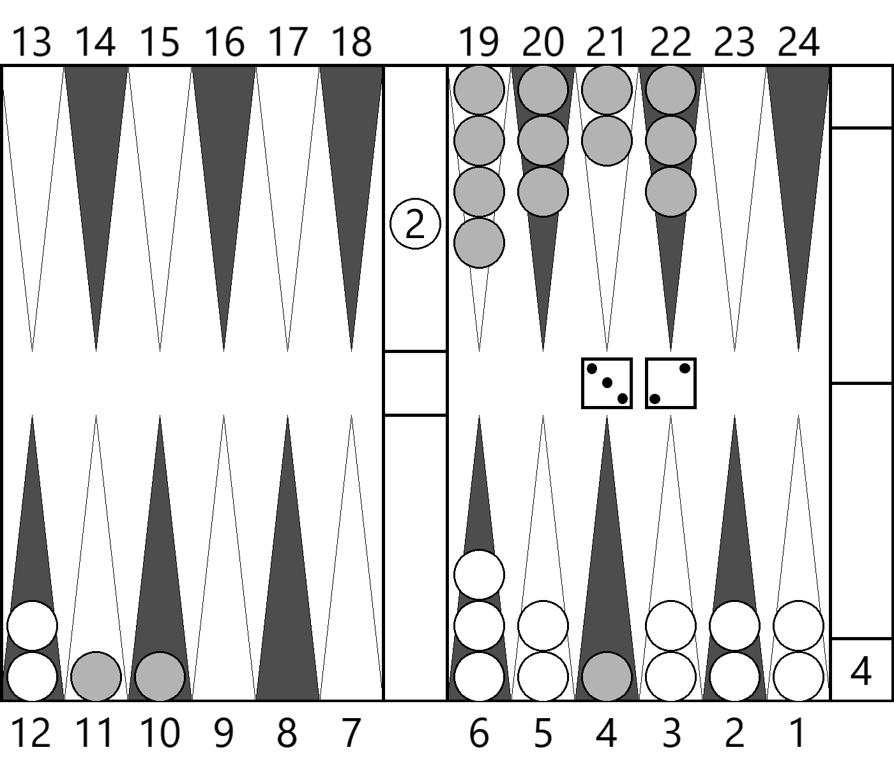

# MakeGammonBoard
バックギャモンの任意の盤面図を以下のような白黒画像で作成するソフト。

# 実行方法
## Windowsの場合
MakeGammonBoard.exeをダブルクリックなどで起動すると、別画面が出てきて`Input XGID`と表示されます。
次のセクションを参考にXGIDを入力してください。

## Macの場合
MakeGammonBoardをダブルクリックなどで起動すると、別画面が出てきて`Input XGID`と表示されます。
次のセクションを参考にXGIDを入力してください。

## 使い方
バックギャモンソフト[eXtreme Gammon](www.extremegammon.com)で使われるXGIDを張り付けて実行してください。同じフォルダ内に`gammon.png`という画像ファイルができます。
先頭の`XGID=`は省略可能です。あっても無くても動作します。
画像は **実行ごとに上書きされる** 点に注意してください。
成功すると`Output Completed!`と画面に表示されます。何かキーを押すことで終了します。
エラー時はその理由がメッセージとして表示されます。その内容を確認したうえで、再入力してください。

# XGID形式の説明
XGIDについて、初期配置で7ポイントマッチ、スコア0-0、白（下側）プレーヤーの手番、最初のダイス目が64であれば以下のようになります。

`XGID=-BBBaBC---aaB------dcbc--B:2:1:1:32:0:0:0:7:10`

以下、各パラメータの読み方を記します。

XGIDはチェッカーの位置情報とキューブ、手番情報を1行に持ち合わせており、各情報はコロン`:`で区切られます。

1. 最初の`-`と英字を含む26文字は、 **各プレーヤーのチェッカー位置と個数** の情報を持ちます。詳しくは後述。
2. 2番目の数字(`2`)はダブリングキューブの **倍率** を意味します。ダブリングキューブの値は **`2^n`** になります。この場合は`2^2=4`倍になります。
3. 3番目の数字(`1`)はダブリングキューブの **位置** を意味します。`0`ならば中央にあり、`1`ならば下側プレーヤー、`-1`ならば上側プレーヤーにキューブを打つ権利があります。
4. 4番目の数字(`1`)は **手番** を意味し、`1`ならば下側プレーヤー、`-1`ならば上側プレーヤーの手番です。
5. 5番目の数字2桁(`32`)は、**二つのダイスの目** を表します。もし(ダブルを打つ前の状態などで)ダイスを描きたくない場合は **`00`** と打ち込んでください。
6. 6番目の数字(0)は、**下側プレーヤーのスコア** を表します。
7. 7番目の数字(0)は、**上側プレーヤーのスコア** を表します。
8. 8番目の数字は、ポイントマッチでは **クロフォードであるか否かの情報** を持ちます。**基本(ポストクロフォードを含む)は`0`** であり、**クロフォードの場合は`1`** になります。
9. 9番目の数字(7)は、**マッチに勝つための必要ポイント** を意味します。この場合は7ポイントマッチになります。
10. 10番目の最後の数字は、キューブの最大値を意味します。 **描画上の意味はないですが、入力は必須** ですので手入力時は`0`などを入れておいてください。

## XGID位置情報について
26個の文字は、バーとボード上にあるチェッカー情報を与えます。

### 各文字の読み方
+ `-`は、そこにチェッカーがないことを意味します。
+ 小文字`a, b, c, ...`は上側プレーヤー（図では灰色チェッカー表示）のプレーヤーのチェッカーの個数を意味し、`a`から順に`1, 2, 3, ...`と増えていきます。
+ 大文字`A, B, C, ...`は下側プレーヤー（図では白色チェッカー表示）のプレーヤーのチェッカーの個数を意味し、`A`から順に`1, 2, 3, ...`と増えていきます。

### 位置情報
+ 一番左は上側プレーヤーのオン・ザ・バーにあるチェッカーの個数を表します。
+ その間の24個の数字は、右下から始まり時計回りで見た時の位置を表しており、図中の数字`1～24`にそれぞれ対応します。
+ 最後の26番目の数字は、下側プレーヤーのオン・ザ・バーにあるチェッカーの個数を表します。

# 今後の予定
+ GNU Backgammon(gnu bg)のGNUbg ID形式への変換

# 不具合の場合
[Twitter(@ch_suginami)](https://twitter.com/ch_suginami)までDM等でご連絡ください。
