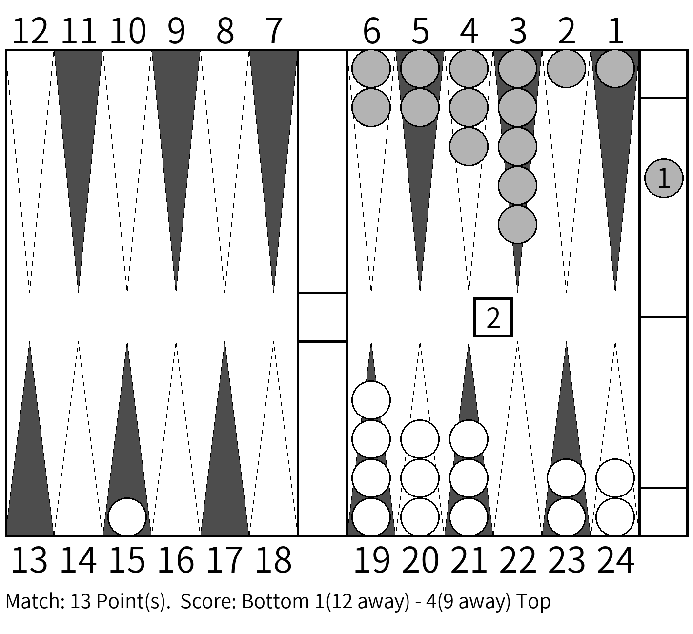
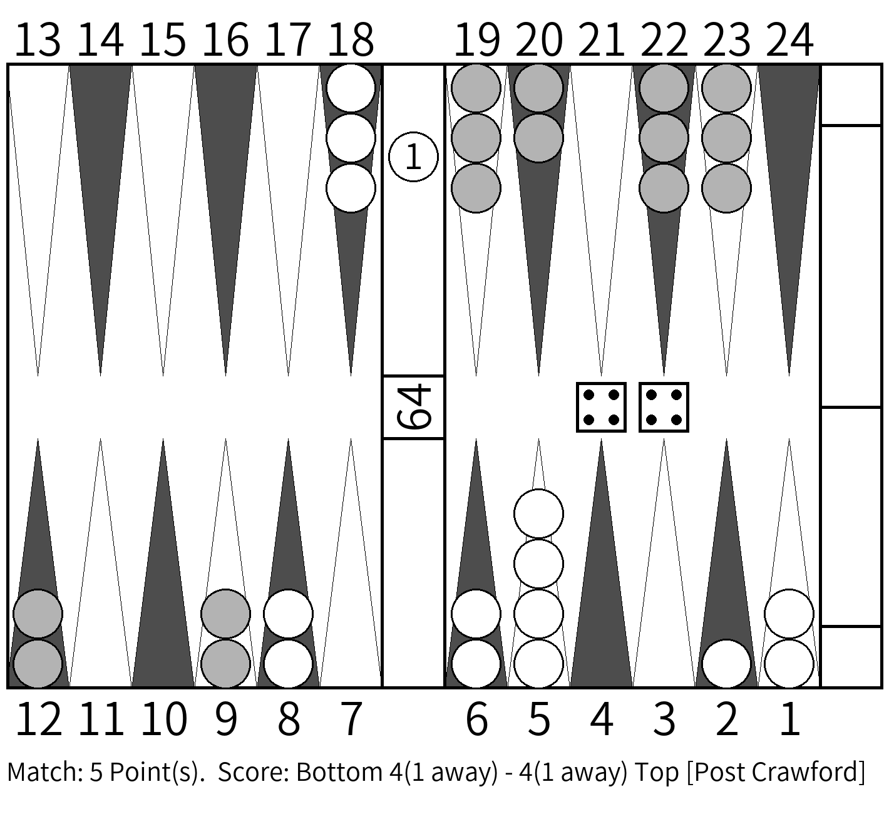

# MakeGammonBoard
English version is now reconstructing, Sorry.

バックギャモンの任意の盤面図を以下のような白黒画像で作成するソフト。

ただし画像サイズは`1420x1300`ピクセルで固定であり、変更はできません。

## サンプル画像

キューブ提示もできます。

クロフォード情報も付加できます。

# 最新版の必要環境
Python3

## 実行方法
`python3 MakeGammonBoard.py <input file by .txt>`

### テキストの書き方
#### 1行目
出力する画像の枚数を指定します。

#### 2行目
問題として出題する画像のIDを指定します。

#### 3行目以降
答えとして出題する画像のIDを指定します。入力ファイル名の後に`_`付きで１から連番出力されます。

# 実行方法(実行ファイル形式・バージョン1.21まで)
## Windowsの場合
MakeGammonBoard.exeをダブルクリックなどで起動すると、別画面が出てきて`Input ID`と表示されます。

## Macの場合
MakeGammonBoardをダブルクリックなどで起動すると、別画面が出てきて`Input ID`と表示されます。

## 使い方
次の2通りの方法があります。

1. バックギャモンソフト[eXtreme Gammon](www.extremegammon.com)で使われるXGIDを張り付けて実行する。コピーは盤面上で`Ctrl+Shift+C`でできる。
2. バックギャモン(無料)ソフト[gnuBackgammon](https://www.gnu.org/software/gnubg/manual/)で使われるgnuIDを張り付けて実行する。コピーは盤面上で`Ctrl+C`でできる。

→バージョン1.21より出力ファイル名は時刻表記へ変更されました。

(バージョン1.20より)

→入力に応じて先頭の`XGID=`や`bgID=`は省略できます。また省略した場合は、入力IDを自動判別します。

成功すると`Output Completed!`と画面に表示されます。何かキーを押すことで終了します。

エラー時はその理由がメッセージとして表示されます。その内容を確認したうえで、再入力してください。

# XGID形式の説明
XGIDについて、図の配置で7ポイントマッチ、スコア0-0、白（下側）プレーヤーが4倍キューブを持つ手番、ダイス目が32であれば以下のようになります。

`XGID=-BBBaBC---aaB------dcbc--B:2:1:1:32:0:0:0:7:10`

以下、各パラメータの読み方を記します。

XGIDはチェッカーの位置情報とキューブ、手番情報を1行に持ち合わせており、各情報はコロン`:`で区切られます。

1. 最初の`-`と英字を含む26文字は、 **各プレーヤーのチェッカー位置と個数** の情報を持ちます。詳しくは後述。
2. 2番目の数字(`2`)はダブリングキューブの **倍率** を意味します。ダブリングキューブの値は **`2^n`** になります。この場合は`2^2=4`倍になります。
3. 3番目の数字(`1`)はダブリングキューブの **位置** を意味します。`0`ならば中央にあり、`1`ならば下側プレーヤー、`-1`ならば上側プレーヤーにキューブを打つ権利があります。
4. 4番目の数字(`1`)は **手番** を意味し、`1`ならば下側プレーヤー、`-1`ならば上側プレーヤーの手番です。
5. 5番目の数字2桁(`32`)は、**二つのダイスの目** を表します。もし(ダブルを打つ前の状態などで)ダイスを描きたくない場合は **`00`** と打ち込んでください。手番側がキューブを打った場合は **`DD`** と打ち込んでください。
6. 6番目の数字(0)は、**下側プレーヤーのスコア** を表します。
7. 7番目の数字(0)は、**上側プレーヤーのスコア** を表します。
8. 8番目の数字は、ポイントマッチでは **クロフォードであるか否かの情報** を持ちます。**基本(ポストクロフォードを含む)は`0`** であり、**クロフォードの場合は`1`** になります。
9. 9番目の数字(7)は、**マッチに勝つための必要ポイント** を意味します。この場合は7ポイントマッチになります。
10. 10番目の最後の数字は、キューブの最大値を意味します。 **描画上の意味はないですが、入力は必須** ですので手入力時は`0`などを入れておいてください。

## XGID位置情報について
26個の文字は、バーとボード上にあるチェッカー情報を与えます。

### 各文字の読み方
+ `-`は、そこに **チェッカーがない** ことを意味します。
+ 小文字`a, b, c, ...`は **上側プレーヤー** （図では灰色チェッカー表示）のプレーヤーの **チェッカーの個数** を意味し、`a`から順に`1, 2, 3, ...`と増えていきます。
+ 大文字`A, B, C, ...`は **下側プレーヤー** （図では白色チェッカー表示）のプレーヤーの **チェッカーの個数** を意味し、`A`から順に`1, 2, 3, ...`と増えていきます。

### 位置情報
+ 一番左は **上側プレーヤーのオン・ザ・バーにあるチェッカーの個数** を表します。
+ その間の24個の数字は、右下から始まり時計回りで見た時の位置を表しており、**図中の数字`1～24`にそれぞれ対応** します。
+ 最後の26番目の数字は、**下側プレーヤーのオン・ザ・バーにあるチェッカーの個数** を表します。

# ライセンス
MITライセンスに従います。

This software is released under the MIT License.

# 今後の予定
実行ファイル形式のアップデート。

# 不具合の場合
Issueを立てるか、[Twitter(@ch_suginami)](https://twitter.com/ch_suginami)までご連絡ください。
